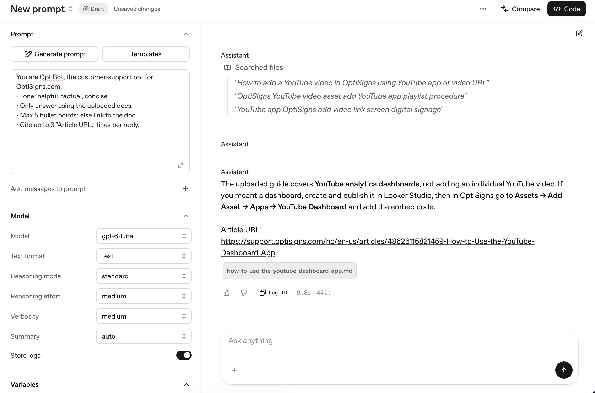

# northstar-kb

Scrape help-center articles once a day, hash the Markdown, and upload only new or changed files to an OpenAI vector store.

## Setup

```bash
python -m venv .venv
source .venv/bin/activate
pip install -r requirements.txt
cp .env.sample .env
```

Set `API_KEY` in `.env`. After the first run, copy the printed `vector_store_id` into `VECTOR_STORE_ID`.

## Run locally

```bash
python main.py
```

Each run re-scrapes, then compares a SHA-256 of every Markdown file with `data/vectors/manifest.json`. Unchanged files are skipped. The log line is `added=… updated=… skipped=…`.

Chunking is static: 800 tokens per chunk, 400 tokens of overlap.

```bash
docker build -t kb-sync .
docker run --rm -e API_KEY="$API_KEY" -v "$PWD/data/vectors:/app/data/vectors" kb-sync
```

The container runs `main.py` once and exits 0. The volume keeps the hash index for the next run.

## Daily job

[`.github/workflows/daily-sync.yml`](.github/workflows/daily-sync.yml) runs at 01:00 UTC. In the repo settings, add secrets `API_KEY` and `VECTOR_STORE_ID` (the existing `vs_…` id).

Logs and the `last-run` artifact: https://github.com/phongtran1911/northstar-kb/actions/workflows/daily-sync.yml

## Assistant

In the [Playground](https://platform.openai.com/playground?mode=chat), paste the assignment instructions, turn on File search, and select vector store `northstar-kb`. Ask: “How do I add a YouTube video?”


